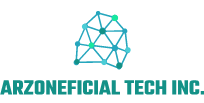

 

  
  

    Beyond the sky
     
    <a href="https://github.com/Skyman1208/Test-iCrime"><strong>Explore the docs »</strong></a>
     
     
  

## CONTENTS

* [ABOUT](#ABOUT)
* [VISION & MSSION](#VISION-&-MSSION)
* [BOARD OF DIRECTORS](#BOARD-OF-DIRECTORS)

## ABOUT
Arzoneficial Tech Inc. was incorporated on 15 September 2019.Arzoneficial Tech Inc. has more than 10 Billion dollar assets around the world. The company is located on a 50,000 sq ft of land in Durian Tunggal, Melaka which houses its R&D centre and production line facility. "Our team is running to convert our Malaysian technology to high-end technology. So that we can compete with others country in producing high quality products."

## VISION & MSSION

### Vision
1. Team work
2. High quality products

### Mission
1. Malaysia Revolution Industry 4.0
2. Bring high quality Malaysia products into a global markets

## BOARD OF DIRECTORS
The structure, responsibilities, and powers given to a board of directors are determined by the bylaws of a company or organization. The bylaws generally determine how many board members there are, how the members are elected, and how frequently the board members meet. There’s not a set number or structuring for a board of directors; it depends largely on the company or organization, the industry in which the company or organization operates, and the shareholders.

### Muhammad Azri
(Chief Executive Officer)

### Aiman Iskandar
(Senior Vice President Corporate Development)

### Ariff Rahimin
(Chief Operations Officer)

### Haziq Izzuddin
(Chief Financial Officer)
